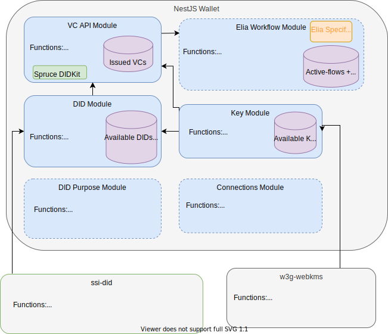

<p align="center">
  <a href="https://www.energyweb.org" target="blank"></a>
  <a href="https://www.eliagroup.com/" target="blank"></a>
</p>


# EWF Self-Sovereign-Identity (SSI) Wallet Apps

## Description
This repository provides *sample* Self-Sovereign-Identity (SSI) wallet applications and libraries to enable these apps.
These are currently provided for demonstration purposes.

These SSI wallet apps are a component of the [Energy Web Decentralized Operating System](#ew-dos).
For more information about SSI at EWF, see the [EWF Gitbook page on SSI](https://energy-web-foundation.gitbook.io/energy-web/foundational-concepts/self-sovereign-identity).

## Relationship to other EWF components

### iam-client-lib
[iam-client-lib](https://github.com/energywebfoundation/iam-client-lib/) provides SSI related functions such as interaction with EWF's Switchboard role credential definitions, credential request and issuance and connection to the iam-cache-server.
However, it does not provide any functionality for key or DID management.
Therefore, iam-client-lib can be used with the keys and DIDs managed by the wallet applications.

### iam-cache-server
[iam-cache-server](https://github.com/energywebfoundation/iam-cache-server)'s persistence of issued credentials, requested credentials and DID relationships can used as a shared trusted third-party between wallets.

### ew-did-registry
[ew-did-registry](https://github.com/energywebfoundation/ew-did-registry) Though some code should be integrated between ew-did-registry and this repository,
it is currently useful to have the sample wallets in a separate application to avoid a circular dependency where `iam-client-lib` depends on `ssi/ew-did-registry` which depends on `iam-client-lib`.

## Architecture



### NestJS DID Module Architecture Example

The DID Module in the [nestjs-wallet](./apps/nestjs-wallet) offers the generation of DIDs.
However, the DID generation logic is encapsulated in a [did](./libraries/did) library.
This allows the logic to shared between wallets of various form-factors (e.g. nodejs wallet and web wallet).

Often DID generation requires the generation of a new public-private keypair.
This is the case for an `ethr` DID, which requires the generation of a new `secp256k1` key. This key is the initial controlling key of the new `ethr` DID.
In order to rename agnostic to the key-generation and storage preferences of a particular wallet implementation, the [did](./libraries/did) library relies on key-operation interfaces.
These interfaces are available in the [kms-interface](./libraries/kms-interface) library.

[Link to Mermaid editor](https://mermaid-js.github.io/mermaid-live-editor/edit/#eyJjb2RlIjoiY2xhc3NEaWFncmFtXG4gICAgTmVzdEpTX0tleVNlcnZpY2UgPHwtLSBLTVNJbnRlcmZhY2VfSVNlY3AyNTZrMUtleUdlblxuICAgIE5lc3RKU19ESURTZXJ2aWNlICotLSBESURMaWJfRXRockRJREZhY3RvcnlcbiAgICBESURMaWJfRXRockRJREZhY3RvcnkgKi0tIEtNU0ludGVyZmFjZV9JU2VjcDI1NmsxS2V5R2VuXG4gICAgY2xhc3MgS01TSW50ZXJmYWNlX0lTZWNwMjU2azFLZXlHZW4ge1xuICAgICAgPDxpbnRlcmZhY2U-PlxuICAgICAgZ2VuZXJhdGVTZWNwMjU2azEoKVxuICAgIH1cbiAgICBjbGFzcyBOZXN0SlNfS2V5U2VydmljZSB7XG4gICAgICBnZW5lcmF0ZVNlY3AyNTZrMSgpXG4gICAgfVxuICAgIGNsYXNzIE5lc3RKU19ESURTZXJ2aWNle1xuICAgICAgZ2VuZXJhdGVFdGhyRElEKClcbiAgICB9XG4gICAgY2xhc3MgRElETGliX0V0aHJESURGYWN0b3J5e1xuICAgICAgZ2VuZXJhdGUoKVxuICAgIH1cbiAgICAgICAgICAgICIsIm1lcm1haWQiOiJ7XG4gIFwidGhlbWVcIjogXCJkZWZhdWx0XCJcbn0iLCJ1cGRhdGVFZGl0b3IiOmZhbHNlLCJhdXRvU3luYyI6dHJ1ZSwidXBkYXRlRGlhZ3JhbSI6ZmFsc2V9)

[](https://mermaid-js.github.io/mermaid-live-editor/edit/#eyJjb2RlIjoiY2xhc3NEaWFncmFtXG4gICAgTmVzdEpTX0tleVNlcnZpY2UgPHwtLSBLTVNJbnRlcmZhY2VfSVNlY3AyNTZrMUtleUdlblxuICAgIE5lc3RKU19ESURTZXJ2aWNlICotLSBESURMaWJfRXRockRJREZhY3RvcnlcbiAgICBESURMaWJfRXRockRJREZhY3RvcnkgKi0tIEtNU0ludGVyZmFjZV9JU2VjcDI1NmsxS2V5R2VuXG4gICAgY2xhc3MgS01TSW50ZXJmYWNlX0lTZWNwMjU2azFLZXlHZW4ge1xuICAgICAgPDxpbnRlcmZhY2U-PlxuICAgICAgZ2VuZXJhdGVTZWNwMjU2azEoKVxuICAgIH1cbiAgICBjbGFzcyBOZXN0SlNfS2V5U2VydmljZSB7XG4gICAgICBnZW5lcmF0ZVNlY3AyNTZrMSgpXG4gICAgfVxuICAgIGNsYXNzIE5lc3RKU19ESURTZXJ2aWNle1xuICAgICAgZ2VuZXJhdGVFdGhyRElEKClcbiAgICB9XG4gICAgY2xhc3MgRElETGliX0V0aHJESURGYWN0b3J5e1xuICAgICAgZ2VuZXJhdGUoKVxuICAgIH1cbiAgICAgICAgICAgICIsIm1lcm1haWQiOiJ7XG4gIFwidGhlbWVcIjogXCJkZWZhdWx0XCJcbn0iLCJ1cGRhdGVFZGl0b3IiOmZhbHNlLCJhdXRvU3luYyI6dHJ1ZSwidXBkYXRlRGlhZ3JhbSI6ZmFsc2V9)

## Installation
This repository is a monorepo that uses [Rush](https://rushjs.io/) with the PNPM package manager.

PNPM is used for its speed and solution to NPM doppelgangers (as well as being the default option for rush).
See comparison of [NPM vs PNPM vs Yarn for Rush](https://rushjs.io/pages/maintainer/package_managers/).

### Requirements

PNPM is required. See installation instructions here: https://pnpm.js.org/installation/

Rush is required. See installation instructions here: https://rushjs.io/pages/intro/get_started/

Use rush to install dependencies (not the package manager directly).
In other words, do not run `npm install` or `pnpm install`.
This is because [Rush optimizes](https://rushjs.io/pages/developer/new_developer/) by installing all of the dependency packages in a central folder, and then uses symlinks to create the “node_modules” folder for each of the projects.

```sh
$ rush install
```

### Compile & Build
Use rush to build.

```sh
$ rush build
```

## Run
To run the `nestjs-wallet` app
``` sh
$ cd apps/nestjs-wallet
$ pnpm run start
```
## Testing
To run all tests in one command, a rush script has been added to `./common/config/rush/command-line.json` 
``` sh
$ rush test
```

### NestJS Wallet Tests
The NestJS wallet app has separate unit and e2e tests.
See NestJS [testing documentation](https://docs.nestjs.com/fundamentals/testing#testing) for more information.
These can be run with separate commands if desired.

First navigate to the app
``` sh
$ cd apps/nestjs-wallet
```

Then, to run **unit** tests
``` sh
$ pnpm test:unit
```

Or, to run **e2e** tests
``` sh
$ pnpm test:e2e
```

## Documentation

## Who is Using This Repo?

## Contributing Guidelines 
See [contributing.md](./contributing.md)


## Questions and Support
For questions and support please use Energy Web's [Discord channel](https://discord.com/channels/706103009205288990/843970822254362664) 

Or reach out to our contributing team members

- TeamMember: email address@energyweb.org


# EW-DOS
The Energy Web Decentralized Operating System is a blockchain-based, multi-layer digital infrastructure. 

The purpose of EW-DOS is to develop and deploy an open and decentralized digital operating system for the energy sector in support of a low-carbon, customer-centric energy future. 

We develop blockchain technology, full-stack applications and middleware packages that facilitate participation of Distributed Energy Resources on the grid and create open market places for transparent and efficient renewable energy trading.

- To learn about more about the EW-DOS tech stack, see our [documentation](https://app.gitbook.com/@energy-web-foundation/s/energy-web/).  

- For an overview of the energy-sector challenges our use cases address, go [here](https://app.gitbook.com/@energy-web-foundation/s/energy-web/our-mission). 

For a deep-dive into the motivation and methodology behind our technical solutions, we encourage you to read our White Papers:

- [Energy Web White Paper on Vision and Purpose](https://www.energyweb.org/reports/EWDOS-Vision-Purpose/)
- [Energy Web  White Paper on Technology Detail](https://www.energyweb.org/wp-content/uploads/2020/06/EnergyWeb-EWDOS-PART2-TechnologyDetail-202006-vFinal.pdf)


## Connect with Energy Web
- [Twitter](https://twitter.com/energywebx)
- [Discord](https://discord.com/channels/706103009205288990/843970822254362664)
- [Telegram](https://t.me/energyweb)

## License

This project is licensed under the GNU General Public License v3.0 or later - see the [LICENSE](LICENSE) file for details

